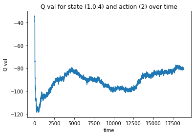

# DDPG debbuging
This project attempt to realize how the critic behave given an observation.
I used the pendulum environment because of the continuous single dimension action space.
The code can be easy adjusted for discrete and multi-dimensional environments.

for environment <a href="https://github.com/openai/gym/wiki/Pendulum-v0">information</a>

The project contains two folders:
* <b>train</b>: train and test code for pendulum environment from gym, using ddpg and keras-rl. nothing special here.<br/>
* <b>debug</b>: critic debugging infrastructure. will produce a graph for (action, Q_a) pair given an observation and an environment.
<br/>In addition, I created fit callback to record for each state,action pair the amount of time they occured and the history of their Q function.
The callback takes a continuous space (observation or actions) or divide it into discrete bins.
### examples
can be found under debug/out  folder, or by running the debug/critic.py script.
I tested for theta between -2pi and 2pi in steps of pi/2, and theta-dot = 0 for all.

</img>

The callback's df is in train/logs and recorded the learning process for 100,000 steps.
We can observe things like exploration, exploitation and Q value evaluation.

for example (from ddpg_debug_csv_example.ipynb):


```python
import pandas as pd
import matplotlib.pyplot as plt
from ast import literal_eval
df = pd.read_csv('train/logs/ddpg_data.csv',index_col=0)
df.head()
```


<div>
<style scoped>
    .dataframe tbody tr th:only-of-type {
        vertical-align: middle;
    }

    .dataframe tbody tr th {
        vertical-align: top;
    }

    .dataframe thead th {
        text-align: right;
    }
</style>
<table border="1" class="dataframe">
  <thead>
    <tr style="text-align: right;">
      <th></th>
      <th>state</th>
      <th>action</th>
      <th>c</th>
      <th>Q</th>
    </tr>
  </thead>
  <tbody>
    <tr>
      <th>0</th>
      <td>[-1. -1. -8.]</td>
      <td>[-2.]</td>
      <td>0</td>
      <td>[]</td>
    </tr>
    <tr>
      <th>1</th>
      <td>[-1. -1. -8.]</td>
      <td>[-1.]</td>
      <td>0</td>
      <td>[]</td>
    </tr>
    <tr>
      <th>2</th>
      <td>[-1. -1. -8.]</td>
      <td>[0.]</td>
      <td>0</td>
      <td>[]</td>
    </tr>
    <tr>
      <th>3</th>
      <td>[-1. -1. -8.]</td>
      <td>[1.]</td>
      <td>0</td>
      <td>[]</td>
    </tr>
    <tr>
      <th>4</th>
      <td>[-1. -1. -8.]</td>
      <td>[2.]</td>
      <td>0</td>
      <td>[]</td>
    </tr>
  </tbody>
</table>
</div>


We divided our action and observation space into 5 bins, therefore we should have a total of 5*5*5*5 rows. <br/>
5^3 for (1,3) state vector and another 5 for action vector.


```python
total_rows = df.shape[0]
print("rows:",total_rows)
```

    rows: 625
    

We can see a (1,3) state vector and (1,1) action vector.<br/>
They both occured 0 times therefore has no Q history.<br/>
Lets see How many State Action pairs never occured:


```python
never_occured = df[df.c==0].shape[0]

print((never_occured*100)/total_rows,"% never occured")
```

    61.76 % never occured
    

Let's demonstrate the Q function history for the most selected action_state pairs:


```python
most_c = df[df.c == df.c.max()]
most_c
```


<div>
<style scoped>
    .dataframe tbody tr th:only-of-type {
        vertical-align: middle;
    }

    .dataframe tbody tr th {
        vertical-align: top;
    }

    .dataframe thead th {
        text-align: right;
    }
</style>
<table border="1" class="dataframe">
  <thead>
    <tr style="text-align: right;">
      <th></th>
      <th>state</th>
      <th>action</th>
      <th>c</th>
      <th>Q</th>
    </tr>
  </thead>
  <tbody>
    <tr>
      <th>569</th>
      <td>[1. 0. 4.]</td>
      <td>[2.]</td>
      <td>11048</td>
      <td>[-39.084824, -39.03244, -38.879787, -43.919815...</td>
    </tr>
  </tbody>
</table>
</div>


```python
y = literal_eval(most_c.Q.iloc[0])
x = range(len(x))
plt.xlabel('time')
plt.ylabel('Q val')
plt.title('Q val for state (1,0,4) and action (2) over time')
plt.plot(x,y)
```


    [<matplotlib.lines.Line2D at 0x1bb94bca4e0>]





 
